# Domain/Subdomain Takeover and Threat Actors

### Introduction

:heavy_plus_sign: ```(What is Website defacement?)```
- https://en.wikipedia.org/wiki/Website_defacement

:heavy_plus_sign: ```(In what ways are websites defaced?)```
- https://www.imperva.com/learn/application-security/website-defacement-attack/

 #### Today, websites hacking methods are generally as follows.
 
 - Brute Force (e.g. [URL](https://wordpress.org/support/article/brute-force-attacks/ "URL"))
 - SQLi (e.g. [URL](https://portswigger.net/web-security/sql-injection "URL"))
 - XXE (e.g. [URL](https://portswigger.net/web-security/xxe "URL"))
 - SSRF (e.g. [URL](https://portswigger.net/web-security/ssrf "URL"))
 - RCE (e.g. [URL](https://www.checkpoint.com/cyber-hub/cyber-security/what-is-remote-code-execution-rce/ "URL"))

#### But today's topic is "Domain/Subdomain Takeover"

:heavy_plus_sign: ```(What is Domain/Subdomain Takeover?)```

 - 1 (e.g. [URL](https://developer.mozilla.org/en-US/docs/Web/Security/Subdomain_takeovers "URL"))
 - 2 (e.g. [URL](https://www.hackerone.com/application-security/guide-subdomain-takeovers "URL"))

#### I've been wanting to write about this topic for a long time because as far as I can see, it is possible to hack a hundred thousand or even a million websites (more precisely, domains and subdomains) with this method. (Of course, I won't explain this part.)

#### The subject we will talk about is how this process works and the hunt for defacer.

#### Let's Go!

---

#### A while ago, while browsing the zone sites used by threat actors, something caught my eye. This thing is exactly in the picture below.

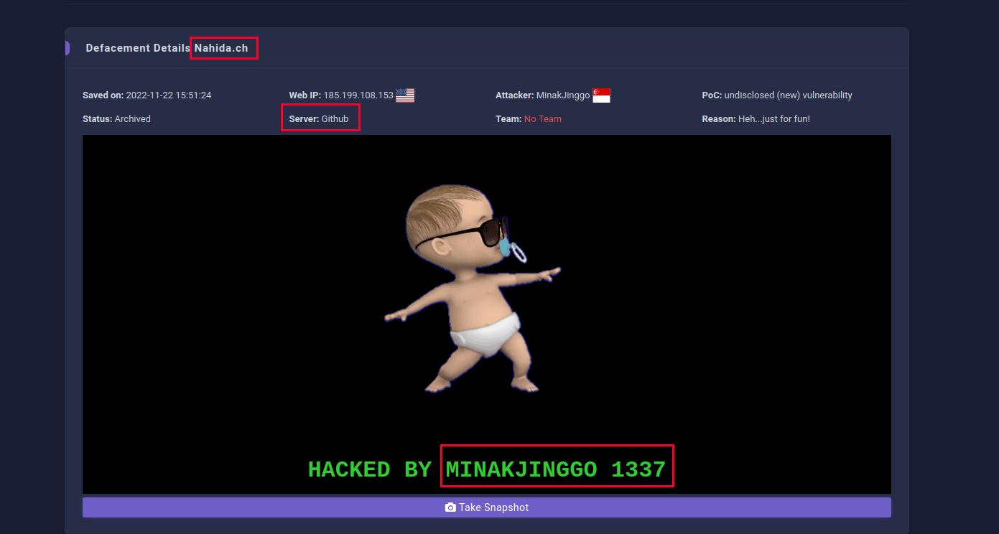

#### When I saw the Github phrase, I immediately thought of github subdomain takeover and went to github and searched for the domain I saw.

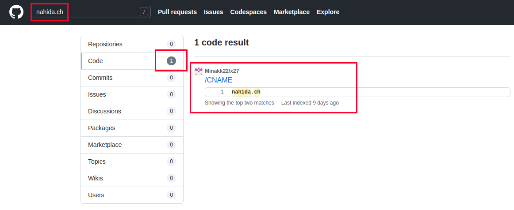

#### I found the github account of the direct threat actor. Then I verified the html file and cname in the zone record.

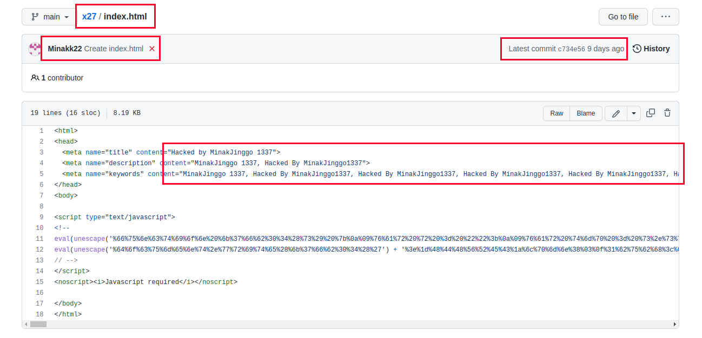

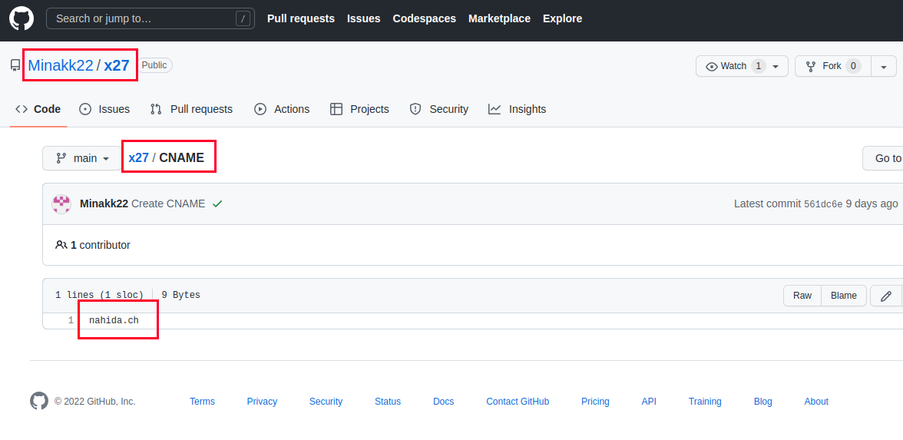

#### I just noticed that he inherited 637 different domains and subdomains on this account. After reviewing a few of them, seeing that it deleted some cnames, I searched and found these deleted cnames on github again.

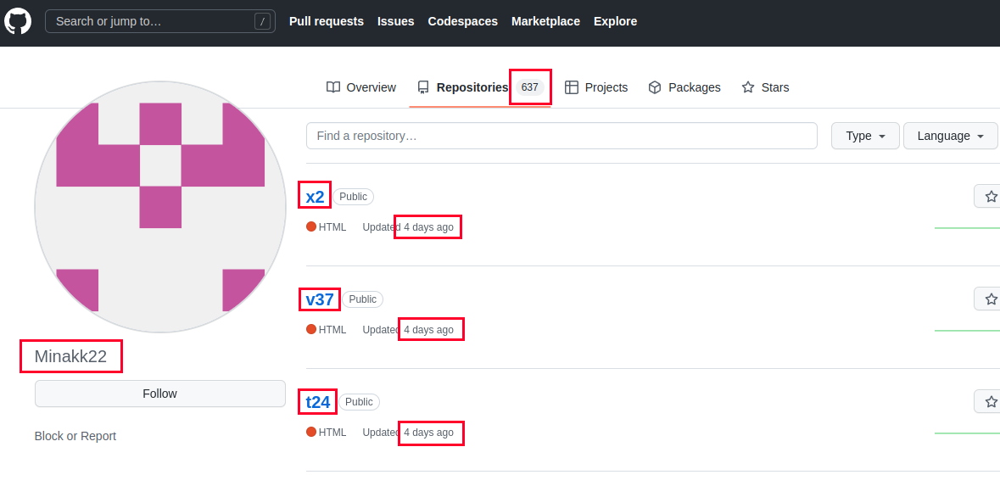

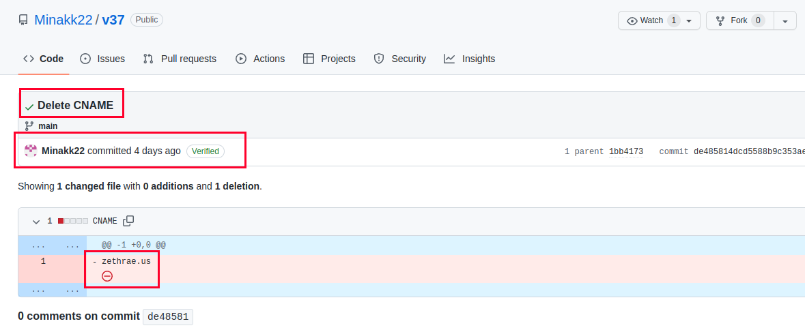

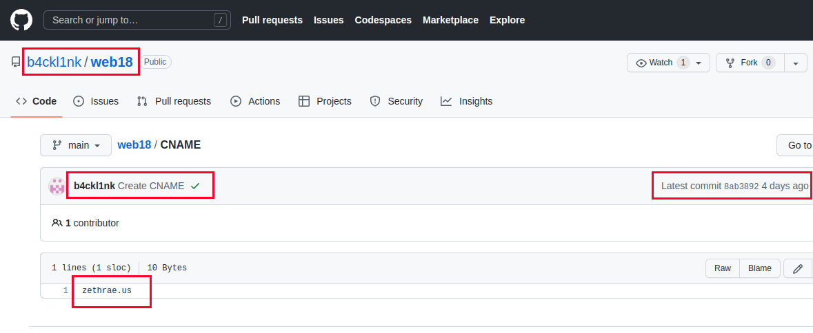

#### Also, this threat actor redirected the domains hacked from his new github profile to his own website.

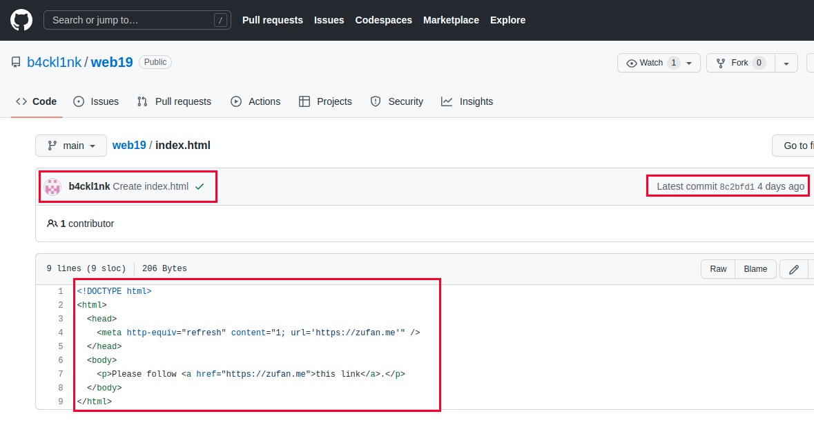

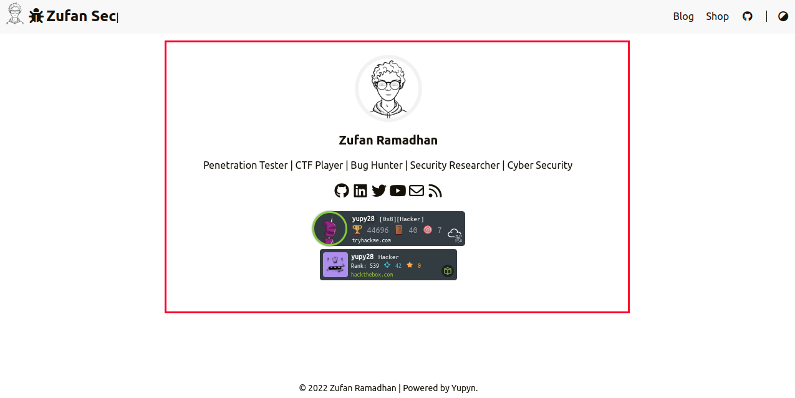

#### Also, when I looked at the social media links in the threat actor's profile, I came across the abbreviations "Yupy Security" and "YP".

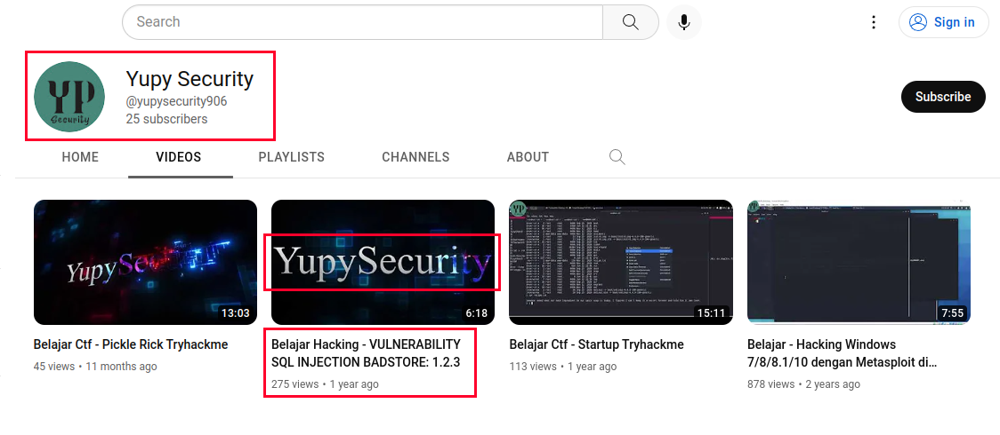

#### On the github profile of threat actor, the only account he followed was his side account, and his side account also had a twitter profile.

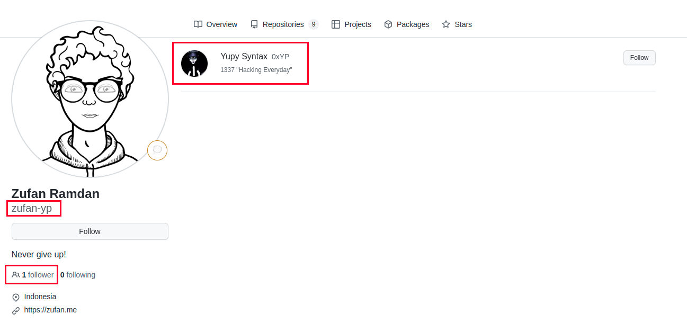

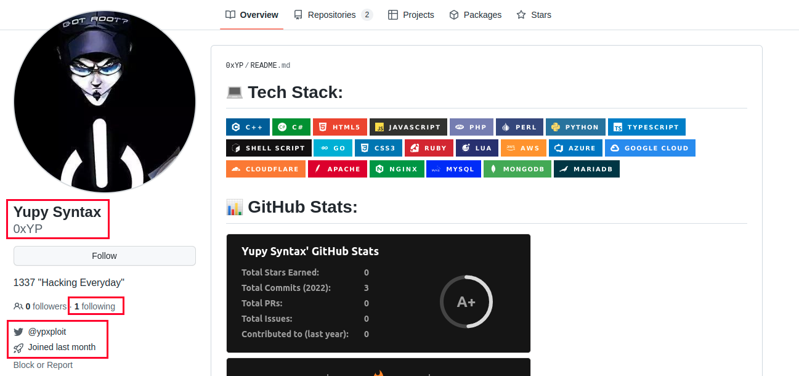

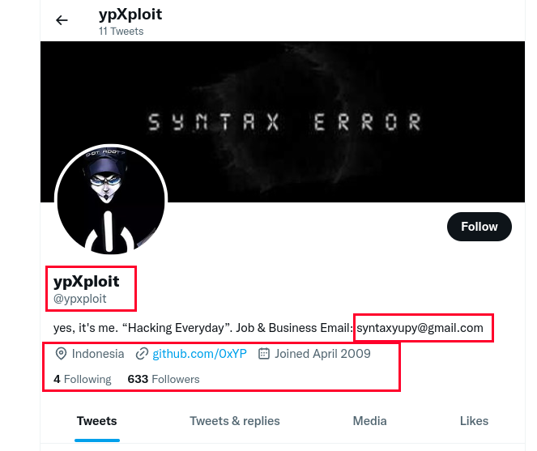

#### You can clearly see that all the profiles and deface processes I have described in this regard belong to a single person.

#### In addition, I learned which tool (reconftw) he used from the screenshot he shared on his profile 

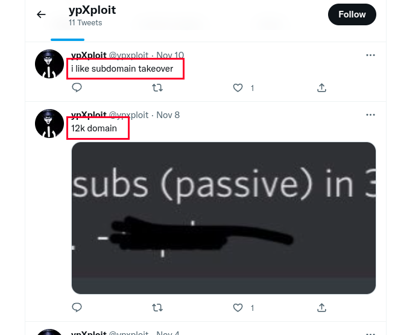

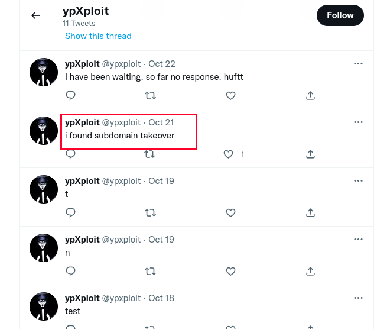

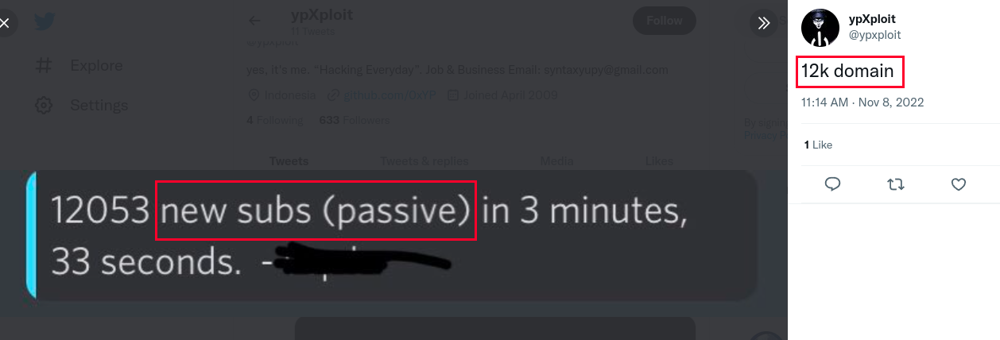

#### Result: MinakJinggo1337 = Minakk22 = b4ckl1nk = Zufan Ramadhan = zufan-yp = Yupy Syntax 0xYP = ypxploit = yupy28 (Using different usernames doesn't change the fact that you're retarded.)

#### Of course I tinkered with this topic for a few more hours and found about 44 github accounts.

 - ([URL](https://gist.github.com/X-Samurai/3b854aa50585ac391fab138c82ad004b))

#### Even though the environment is virtual, the crime committed is real! I wish you to be constructive, not destructive!

#### :heavy_plus_sign: Thank you for reading!

, Respects

X-Samurai
